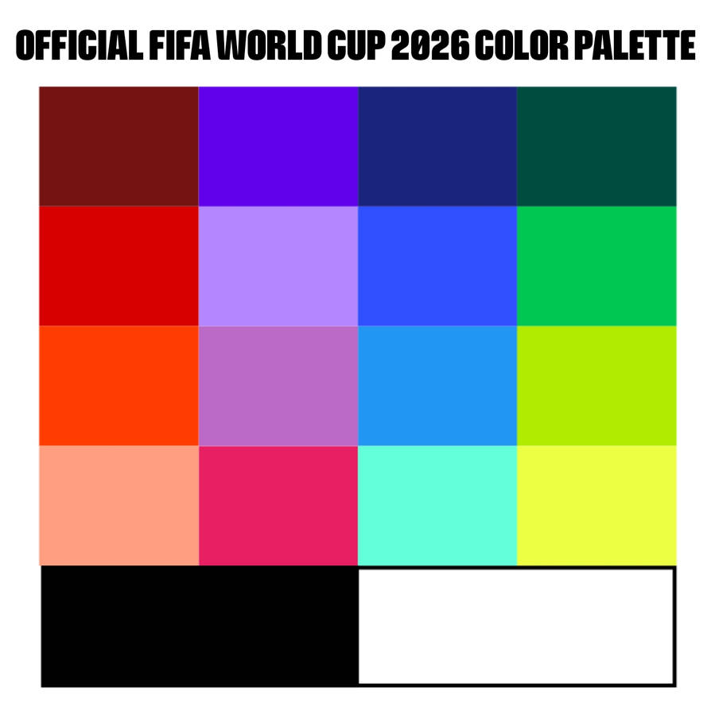

# Exercise 2

Built using Debian with Android Studio Panda 3

```console
$ studio --version

Android Studio Panda 3 | 2025.3.3
Build #AI-253.31033.145.2533.15113396
```

## Base requirements

- **Team listing**: `LazyColumn` with the 48 teams of World Cup 2026 from `teams2026.php?league=1&season=2026`. Each card shows country name, flag, FIFA code, founding year and venue details with capacity.
- **Player visualization**: tapping a team navigates to its squad (`squads.php?team=ID`). Each player shows photo, name, position, age and jersey number. The data source is switchable from the side menu (official API-Football or Computomovil mock). When connection drops and recovers, data refetches automatically.
- **Connectivity handling**: network monitor that verifies real internet access via ping to `8.8.8.8:53`, on top of checking for WiFi or mobile data. Network errors are shown with a persistent banner and screens offer a retry button.
- **Internationalization**: all strings are in `strings.xml`, with zero hardcoded text. Three languages: Spanish (default), French and English.
- **Color palette**: constants in `Color.kt` inspired by FIFA World Cup 2026, with zero hardcoded colors in composables.

## Extras

- **Dark / light theme**: switchable from the side menu, with reactive transition and adaptive status bar
- **Animated splash screen**: the native splash blends into a Compose animation (logo scale + text fade-in)
- **Typeface**: Barlow Condensed across all text styles, similar to the official FIFA World Cup 2026 font
- **Architecture**: Jetpack Compose + Material 3 + MVVM (ViewModel + Repository + Retrofit), state via `StateFlow` and reactive UI via `collectAsState()`

## Building

```console
./gradlew assembleDebug
```

## Demo

## Palette

Pallete by Nightingale1000 @ DevianArt

See <https://www.deviantart.com/nightingale1000/art/FIFA-World-Cup-2026-color-palette-1227823295>


